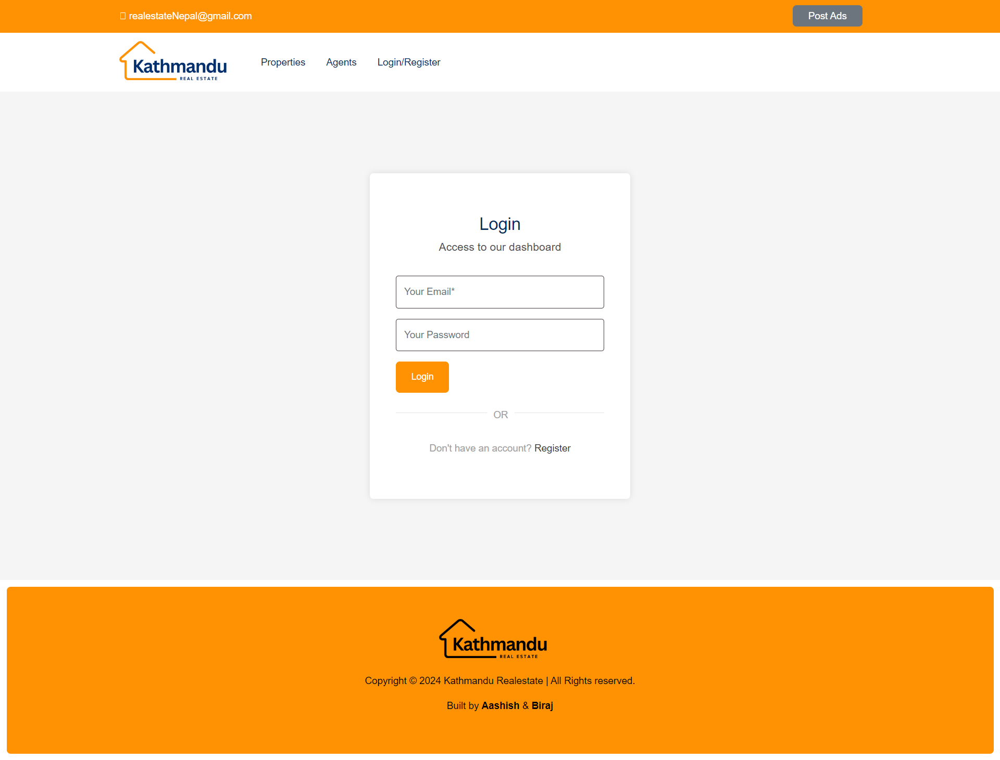
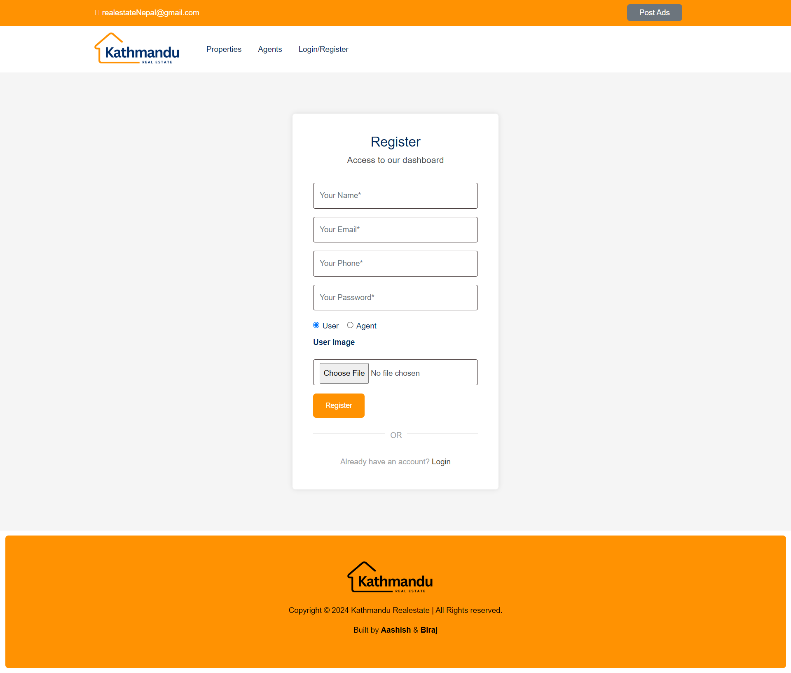
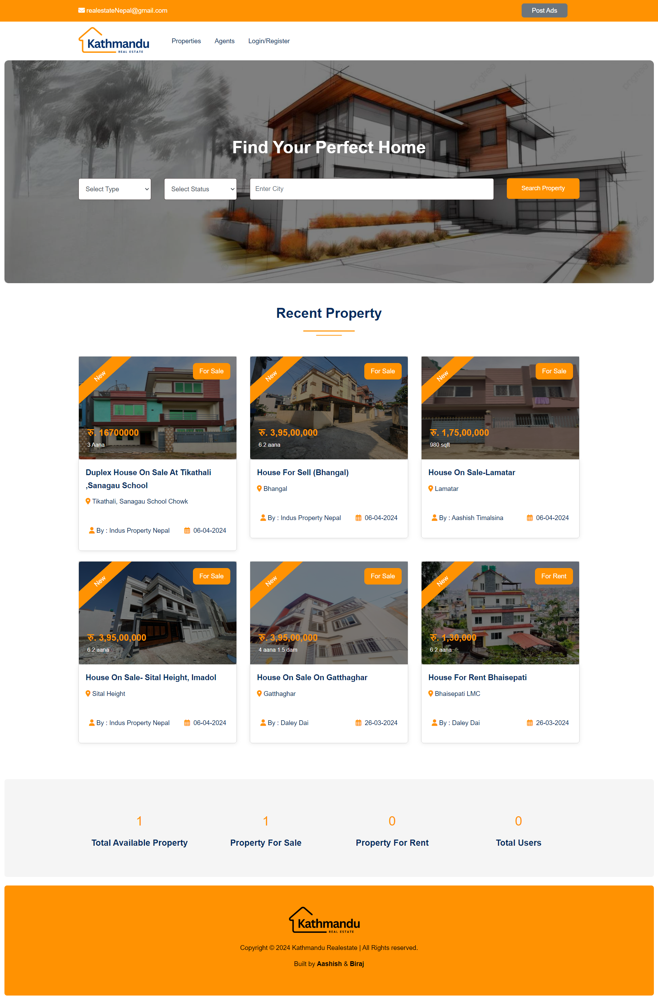
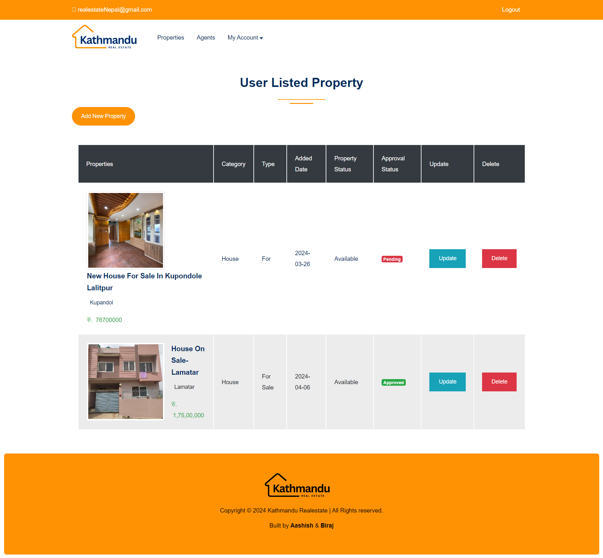
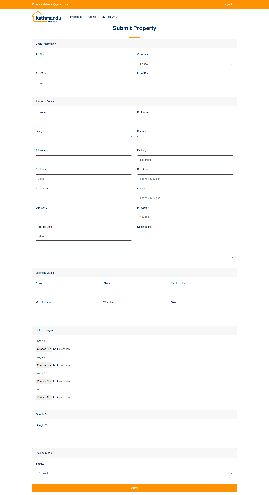
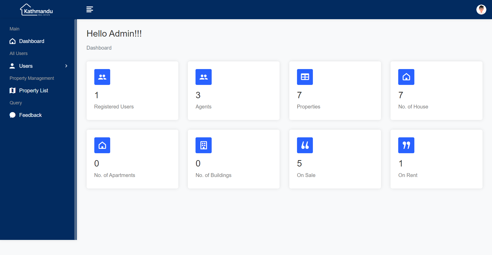
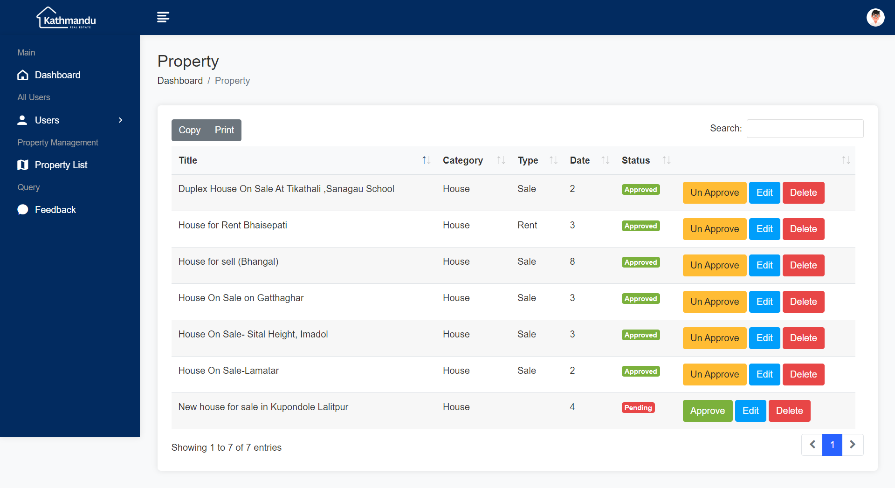

# Kathmandu Real Estate Marketplace

PHP | MySQL | Bootstrap

  

"Kathmandu Real Estate," a dynamic web-based platform designed to facilitate the buying, selling, and renting of properties in the Kathmandu region.
Built using PHP, MySQL, and Bootstrap, Kathmandu Real Estate Marketplace offers a comprehensive solution for both property seekers and listing agents/owners. The platform allows agents and property owners to create accounts, showcase their properties with detailed descriptions and images, and interact with potential buyers or renters. Users can easily search for properties based on their preferences, such as location, and property type, enhancing the efficiency of the property discovery process.

## Screenshots

## Admin Login

    Username: admin
    Passoword: 12345678
